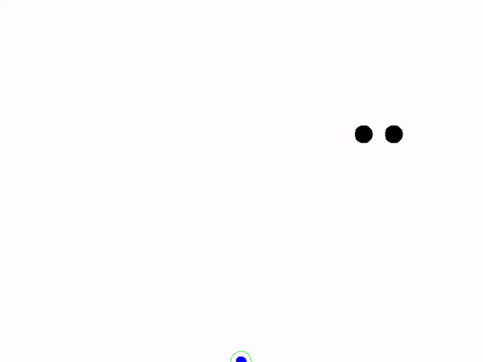

# A Volfied-like game
- No engine used. Just SDL and OpenGL
- betterC
- implements some concepts from scratch:
    * Tween actions
    * collision detection
- Work in progress!!!

## Controls
- Use arrow keys to move the hero
- Start shrinking the polygon using SPACE + arrow keys
- use key P for pause and R for restart

- the game is playeble [here](https://aferust.github.io/drawee/)

## WASM build with emscripten
- dub build --config=wasm --compiler=ldc2 --build=release --build-mode=allAtOnce --combined --arch=wasm32-unknown-unknown-wasm -v

